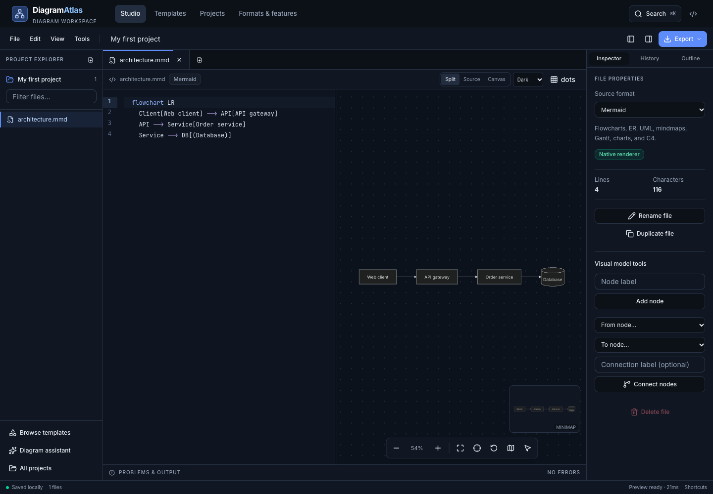

# DiagramAtlas

An open source, browser-based IDE for diagrams, data models, architecture, and charts. Work in projects with multiple source files, a code editor, a live diagram canvas, diagnostics, and version snapshots.

[Open the application](https://muhamadzolfaghari.github.io/diagram-atlas/) · [Format registry](src/lib/formats.js) · [Design system](docs/DESIGN-SYSTEM.md) · [Initial audit](docs/DESIGN-AUDIT.md)

## Workspace

- **Projects and files:** create and rename projects, import source files or folders, switch document tabs, duplicate and rename files, and search the explorer.
- **Code editor:** CodeMirror with language highlighting, Mermaid completions, bracket matching, folding, search, undo/redo, and independent document histories.
- **Live previews:** Mermaid and Graphviz render natively. Other supported languages retain their original editable source and derive a Mermaid preview. Diagnostics explain parser failures and conversion limits. Invalid edits retain the last valid preview for that file.
- **Visual flowchart editing:** select labeled nodes, edit labels, add nodes, and connect existing nodes. Changes update the Mermaid source. Other diagram types remain editable through source.
- **Canvas:** pan, zoom, fit, center, minimap navigation, grid styles, wheel pan/zoom modes, arrow-key navigation, pinch zoom, and presentation mode with a laser pointer.
- **Version checkpoints:** save up to 30 project snapshots and restore the original source of a file.
- **Project portability:** download a `.atlas` project backup or a ZIP of source files. Restore backups in the workspace or Projects page.
- **Diagram assistant:** local rule-based drafts, plus optional Qwen2.5-Coder inference through WebLLM. Qwen requires WebGPU and downloads model weights on first use; no API key is needed. Generated drafts open as new files for review.

## Supported source formats

All 18 entries are available in the new-file dialog, file inspector, and import workflow. Formats are defined once in `src/lib/formats.js`; the Formats page displays the same registry.

| Format | Input | Editing and preview scope |
| --- | --- | --- |
| Mermaid | `.mmd`, `.mermaid`, detected plain text | Native Mermaid rendering: flowcharts, ER, UML class/sequence/state, mindmaps, Gantt, C4, journeys, timelines, Git graphs, Sankey, pie, XY, quadrant, Kanban, and block diagrams. |
| Graphviz | `.dot`, `.gv` | Native DOT rendering through Graphviz WebAssembly. |
| PlantUML | `.puml`, `.plantuml` | Sequence, class, and state subsets to Mermaid. Vendor styling, macros, and full PlantUML grammar are not implemented. |
| D2 | `.d2` | Basic nodes, connections, and containers to Mermaid; approximate layout and styling. |
| SQL DDL | `.sql` | CREATE TABLE columns and foreign keys to ER diagrams. Complex dialect syntax may require simplification. |
| GraphQL SDL | `.graphql`, `.gql` | Types, fields, and relationships to a class diagram. |
| OpenAPI / Swagger | `.json`, `.yaml`, `.yml` | Specification content detection; request sequences from the first 10 paths. |
| AsyncAPI | `.json`, `.yaml`, `.yml` | Specification content detection; event sequences from the first 12 channels, v2/v3. |
| Draw.io | `.drawio`, detected `.xml` | Plain or compressed first-page XML nodes and edges to Mermaid. Original XML remains editable; vendor shapes, geometry, and styling are not reproduced. |
| BPMN 2.0 | `.bpmn`, detected `.xml` | Tasks, events, gateways, and sequence flows to Mermaid; no BPMN execution semantics. |
| C4 / Structurizr DSL | `.dsl`, `.c4` | Basic people, systems, containers, and relationships to C4 context. |
| Terraform HCL | `.tf` | Resources and direct references to architecture graphs. Modules, dynamic blocks, and evaluated values are not resolved. |
| Markdown outlines | `.md`, `.markdown`, `.txt` | Indented outlines to mindmaps, or the first embedded Mermaid code fence. |
| CSV | `.csv` | Source/target relationship rows to a graph. |
| FreeMind | `.mm`, detected `.xml` | Topic hierarchy to a mindmap. |
| OPML | `.opml`, detected `.xml` | Outline hierarchy to a mindmap. |
| XMind | `.xmind` | First sheet of ZEN or legacy workbooks becomes an editable Mermaid mindmap. The imported workbook is retained separately; current mindmaps export to a new XMind workbook. |
| Source code | `.ts`, `.tsx`, `.js`, `.jsx`, `.py`, `.java`, `.cs`, `.go`, `.rs` | Best-effort class/struct extraction to UML. Imported code is not executed. |

Derived previews are models of supported syntax, not lossless vendor renderers. Exporting original source preserves the source as edited; exporting Mermaid downloads the derived view. Unrecognized JSON/XML is rejected with an explanation instead of silently treated as Mermaid.

### UML and chart templates

The library contains **30 starter templates**, including all **14 UML categories**. Class, sequence, and state templates use native Mermaid types. Object and profile models adapt class diagrams; timing models adapt timelines; use case, activity, component, deployment, package, composite structure, communication, and interaction overview models adapt flowcharts. This is not a complete UML metamodel or validator.

Additional templates cover ER schemas, C4 context, cloud topology, product journeys, Kanban, Gantt, mindmaps, prioritization matrices, timelines, Sankey funnels, hardware blocks, Git graphs, and XY charts.

## Exports

- Original editable source in its file format.
- Derived Mermaid source, except native Graphviz previews.
- SVG vector diagrams.
- PNG at 2× or 4× scale; dimensions depend on the diagram.
- PDF with a high-resolution raster image (not vector PDF).
- Standalone HTML containing the rendered diagram and navigation controls.
- XMind workbook for mindmaps.
- `.atlas` backups including project files, open tabs, snapshots, and retained original XMind workbooks.
- ZIP archives with editable source files and a restorable project backup.

Resolve current preview errors before exporting a diagram image. Switch to Canvas or Split view to export images from the current SVG.

## Local storage and privacy

The application has no account service or application backend. Projects are stored in this browser's local storage. Existing NodeFlow/DiagramAtlas drafts and named diagrams remain accessible; they are not deleted during migration.

Browser storage is device- and browser-specific, has a quota, and can be cleared by the user. Download project backups for durable copies. If storage fills, the workspace reports it and still allows a backup download. Source imports are limited to 15 MB per file and 100 files per project; expanded ZIP input is limited to 30 MB.

Libraries, fonts, and optional model weights may be fetched over the network. Source processing runs in the browser. An offline installation is not guaranteed by the hosted application; there is no service worker or shared cloud collaboration in this version.

## Design and navigation

Tailwind v4 semantic tokens, locally owned shadcn/ui/Radix primitives, and CVA variants provide consistent controls and accessible menus and dialogs. React Router uses hash URLs to support direct page refreshes on GitHub Pages:

- `#/` — home and live examples
- `#/studio` — workspace
- `#/studio?project=<id>` — a local project
- `#/studio?template=<id>` — add a template file
- `#/templates` — searchable collections, with URL-based filters
- `#/saved` — Projects and previously saved diagrams
- `#/formats` — supported source formats and conversion limits

The old `#/compare` address redirects to Formats. Unknown routes display a not-found page.

## Reviewed designs



See [verification results and limits](docs/VERIFICATION.md) and the [desktop and phone screenshots](screenshots/enterprise).

## Keyboard controls

| Action | Shortcut |
| --- | --- |
| Save locally | `Ctrl/Cmd + S` |
| Open files | `Ctrl/Cmd + O` or `Ctrl/Cmd + I` |
| New file | `Ctrl/Cmd + Shift + N` |
| Search commands | `Ctrl/Cmd + K` |
| Find in source | `Ctrl/Cmd + F` |
| Undo / redo | Platform editor shortcuts |
| Indent / dedent | `Tab` / `Shift + Tab` |
| Fit / center / reset canvas | `F` / `C` / `0` |
| Zoom | `+` / `−` |
| Pan | Drag or arrow keys; Shift + arrows for larger steps |
| Keyboard help | `?` outside an editor |

## Development

Use Node.js 22 or newer and npm.

```sh
git clone https://github.com/muhamadzolfaghari/diagram-atlas.git
cd diagram-atlas
npm ci
npm run dev
```

```sh
npm run build
npm test
npm run test:unit
npm run test:browser
```

Production files are generated in `dist/`, with the GitHub Pages base path `/diagram-atlas/`. The browser suite starts its own local server, exercises all 18 source formats and workspace workflows, and closes it afterward. Set `ATLAS_TEST_URL` to use an existing server.

## License

MIT, as declared in `package.json`. Dependencies retain their individual licenses.
